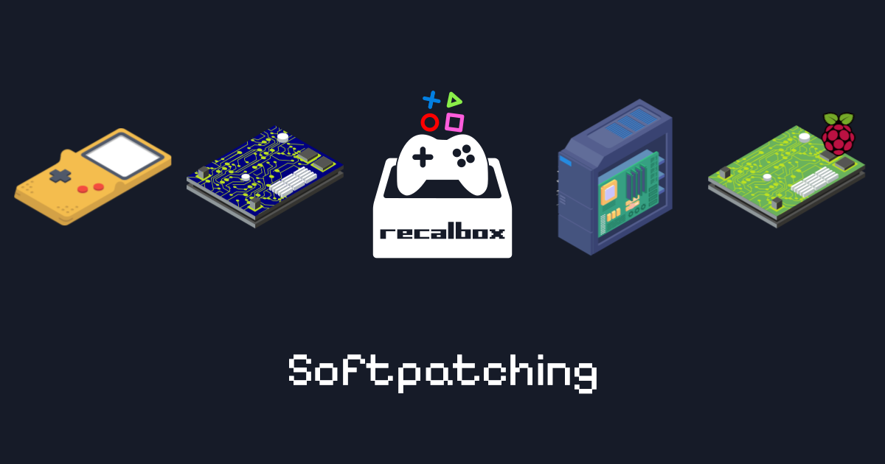

#

## À propos

### Collection de plus de 800 patchs de traduction FR, préparée pour la fonctionnalité de softpatching de Recalbox

- Plus d'info sur [Recalbox](https://www.recalbox.com/fr/ "recalbox.com")

- Plus d'info sur le [softpatching](https://wiki.recalbox.com/fr/basic-usage/features/softpatching "wiki.recalbox.com")

- Vidéo de notre ami Fabrice sur le sujet. [Abonnez-vous!](https://youtu.be/z6rdZ0jpSvs?si=ZQ6eWgdMe-Me4O7T "Chaine Youtube Recalbox")

- Patchs récupérés sur: [traf.romhack.org](https://traf.romhack.org/) et [romhacking.net](https://www.romhacking.net/)

>:heart: Un grand merci à toute l'équipe de **Recalbox**, aux **sites hébergeurs** et aux **traducteurs** :heart:

## Téléchargement

## Utilisation

1. **COPIER / COLLER** chaque dossier de système dans votre dossier **SHARE / ROMS** Recalbox.

2. Choisir l'option **SELECTIONNER** dans **OPTIONS DES JEUX / SOFTPATCHING**.

3. Au lancement du jeu, vous pourrez choisir quel patch à appliquer.

4. À vous les joies de découvrir tout ces jeux, maintenant, en français!!!

## Comment lire le nom d'un patch

- NomduJeu_langue_Auteur_version_info_supplémentaire (ex: NdJ_fr_GohanSenior_v1.0_super_pack)

## Patchs pour

| Nb Jeux | Systèmes | Cores testé |
|:-------:|:--------:|:-----------:|
| 5 | Famicom Disk System (bientôt de retour) | Libretro FCEUmm |
| 119 | Gameboy | Libretro Gambatte :heavy_exclamation_mark: |
| 24 | Gameboy Color | Libretro Gambatte :heavy_exclamation_mark: |
| 13 | Gameboy Advance | Libretro mGBA :heavy_exclamation_mark: |
| 54 | Master System | Libretro Gearsystem |
| 122 | Mega Drive | Libretro Picodrive :heavy_exclamation_mark: |
| 2 | NEO·GEO Pocket Color | Libretro Mednafen_WSWAN |
| 4 | Nintendo 64 | Libretro Mupen64Plus NX |
| 341 | Nintendo Entertainment System | Libretro Nestopia :heavy_exclamation_mark: |
| 149 | Super Nintendo Entertainment System | Libretro Snes9x |
| 2 | Satellaview | Libretro Snes9x |

:heavy_exclamation_mark: Certains patchs nécessitent un core different que celui testé. (voir le fichier patch_fr_debug.txt pour ceux concernés)

## Commentaires

- Pack pour sets No-Intro.

- Je garantie le bon lancement de tout les patchs avec les cores testés. Mais pas les bugs pouvant encore exister en jeu.

- Les fichiers "lisezmoi.txt" présents dans chaque dossier de patch ne sont là qu'à titre informatif.

  :warning: **Quoi que demandé dans le fichier, aucune autre action ne vous est requise**. :warning:

- Pack de traduction anglophone disponible [ici](https://github.com/GohanSenior/Pack-Trans-EN-Sets-No-Intro-Softpatching-Recalbox "Pack-Trans-EN-Sets-No-Intro-Softpatching-Recalbox")

- Je suis disponible sur le [Discord Recalbox](https://discord.gg/GQJREVqrU2) au pseudo **GohanSenior** pour toutes demandes ou propositions.
  
## :video_game: Bons jeux à vous! :round_pushpin:

### GohanSenior
